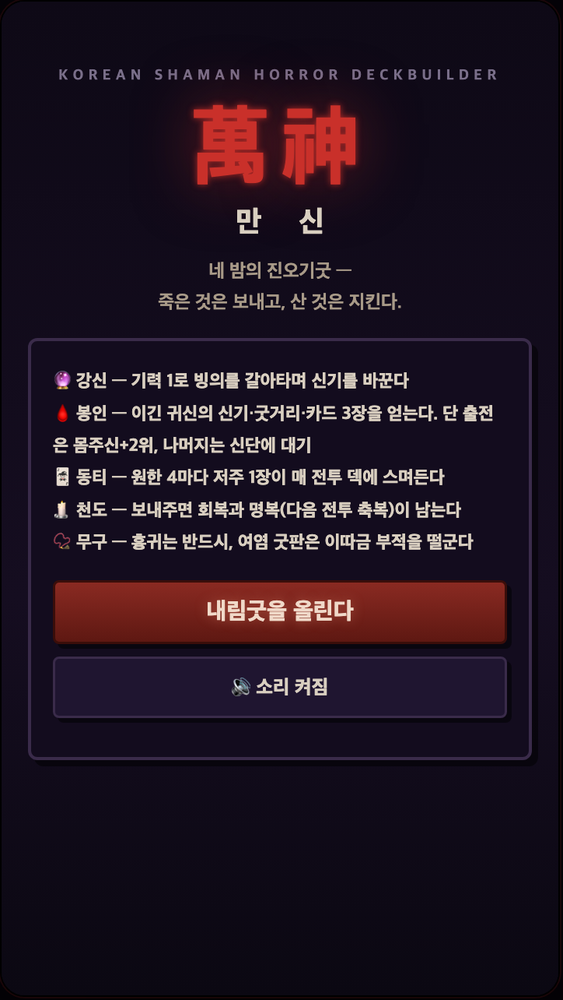
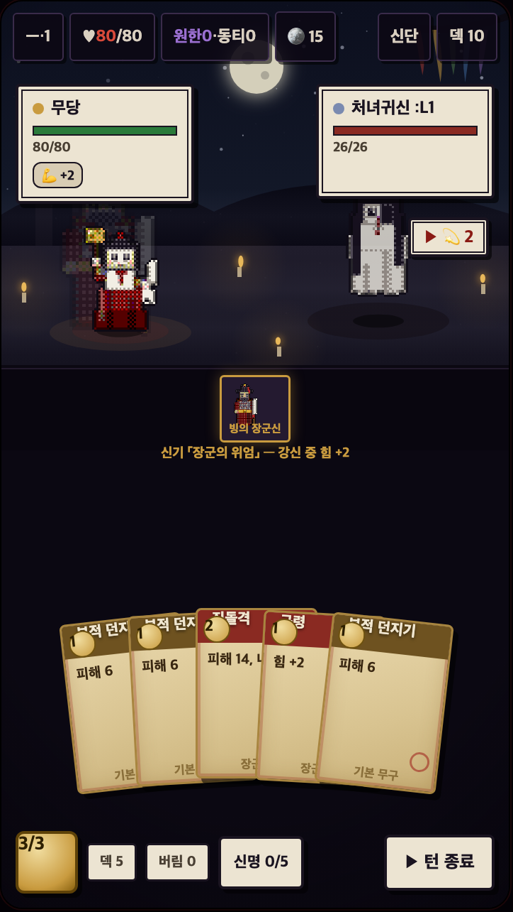

# 만신 (萬神)

**한국 무속 호러 덱빌딩 로그라이크.** 애기무당이 네 밤의 진오기굿을 치르며 귀신을 거두거나 보내준다 — 봉인하면 강해지고, 원한이 쌓인다.

> 현재 버전: 빌드 v10.10 · **플레이테스트 단계**
> 권장 환경: 모바일 세로 360×640 (데스크톱은 창 크기에 맞춰 자동 스케일) · 저장: 브라우저 localStorage (자동 이어하기)

  
  

- 🎮 **플레이 (공식)**: **https://playmanshin.github.io** — 또는 `index.html`을 브라우저로 직접 열기 (서버 불필요)
- 📜 **기획서**: [docs/GDD.md](docs/GDD.md) (현행 설계) · [docs/CHANGELOG.md](docs/CHANGELOG.md) (설계 변경 이력·논거)
- ✅ **회귀 테스트**: `cd tests && ./run.sh` — `ALL_GREEN`이면 통과 (Node 18+ · bash/sed 필요, Windows는 WSL/Git Bash)

## 핵심 시스템

| 시스템 | 내용 |
|--------|------|
| **강신(降神)** | 출전 신령(몸주신+귀신 2위) 중 하나에 빙의. 신력 1로 전투 중 교체 — 신기(오라)가 통째로 바뀐다 |
| **봉인 vs 천도** | 이긴 귀신을 거두면 신기·굿거리·카드 3장. 대신 원한이 쌓여 4마다 저주(동티)가 덱에 스며든다 |
| **해원(解冤)** | 신물(족두리·꽃신·제삿밥…)을 구해 사연이 맞는 귀신에게 건네면 싸우지 않고 거둘 수 있다 |
| **경로 그래프** | StS식 연결 지도 — 解·변종·판효과가 처음부터 보여 몇 수 앞의 경로를 계산한다 |
| **업(業)** | 봉인=신위, 천도=공덕. 무복 색이 변하고 엔딩이 갈린다 (흑무/성무/만신 + 역빙의 배드엔딩) |
| **굿거리** | 카드 5장 = 신명 5 → 빙의 신령의 궁극기. 턴당 1회 |

콘텐츠: 4막(부정→영실→도령→뒷전거리) · 몸주신 6 · 봉인 귀신 18 · 막보스 4 · 카드 90+ · 무구 10 · 판효과 4 · 엔딩 4.

## 개발

- 단일 `index.html` (HTML+CSS+JS, 외부 의존성 0). 작업 규칙·불변식은 [AGENTS.md](AGENTS.md) (기준 문서), Claude 전용 보충은 [CLAUDE.md](CLAUDE.md).
- 캐릭터는 전부 캔버스 블록 드로잉 → 게임보이식 렌더 파이프라인(4단 램프·디더링·외곽선)을 거친 절차적 픽셀 스프라이트.
- 수정 후에는 반드시 `tests/run.sh`가 `ALL_GREEN`이어야 한다.

## 로드맵 (요약)

1. ~~출전 신령 체계 + 몸주신 막간 강화 (장군신·바리공주)~~ ✅
2. ~~나머지 4 몸주신 막간 강화 세트~~ ✅
3. 보상·회복 경제 조정 (플레이테스트 데이터 기반)
4. 막별 전투 규칙 차별화, 변종 패턴화
5. 금제 단계 확장, 메타 해금 (도감·사연)

상세는 [docs/GDD.md](docs/GDD.md) 로드맵 절과 [docs/CHANGELOG.md](docs/CHANGELOG.md) 참조.

## 라이선스

© 2026 playmanshin (audwls624). All rights reserved — 라이선스 미정 (공개 배포 형태 확정 시 결정).
